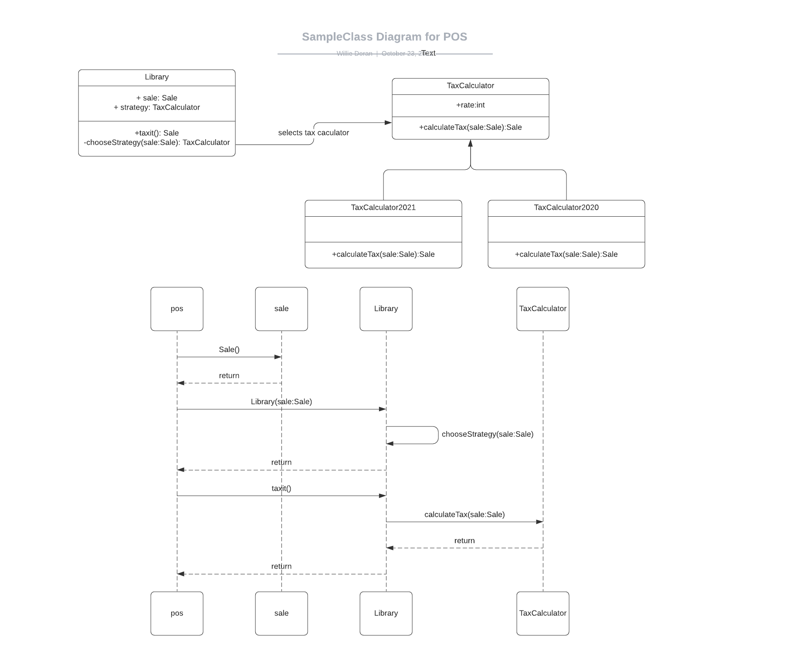

# Part Two: Design
Given the current API contract, I would create an additional parent class called `TaxCalculator` with an interface `calculateTax(sale:Sale):Sale` and as many subclasses that are needed to implement
the various different tax calculations. During the creation of the `Library` instance we can use a factory method to select an appropriate 
tax calculation strategy based on some criteria of the sale (eg the date/timestamp). On invocation of `Library.taxit()` we delegate to the tax calculator
strategy. From a client point of view, the POS system needs no knowledge of how the tax calculation strategies work, however, whenever we need to update
a new tax strategy we will have to update the library factory method.

[Psuedo-code Implementation](Library.py)

If Im honest, the solution above fits the current API contract. However, I would probably refactor the whole class structure
1. Firstly, I would not instantiate the `Library` with a `Sale` object. There is no reason for the library to store this state
   and would require us to protect access to any mutable state. I

2. I would pass the Sale object as a parameter to `taxit()` like this instead `taxit(sale:Sale)`.This would make it easier to test
and make the function a little more "pure" by relying on its input rather than some stored state. Im not a big fan of zero arg functions like this.
   
3. I would not have the POS client call the current constructor of `Library` instead I would have it call a factory to create my Library and inject the appropriate 
tax calculator. In effect this would refactor `Library._chooseStrategy()` into a separate class so that the `Library` doesnt need to know how many tax collector strategies there are.
We would still need to update this factory any time we introducted a new way to calculate tax   